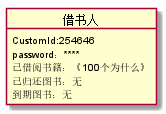

# 实验二：图书管理系统用例建模

| 学号 | 班级 | 姓名 | 照片|
|:----:|:-----:|:----:|:----:|
| 201510414321 | 软件（本）15-3 | 杨汉文| 
# 一、图书管理系统的类图
## 1.1类图PlantUML源码如下：
    @startuml
    left to right direction
    package "Book Manage System" {
    class 预约书籍 {
      BookId
      CustomId
      BookingTime
    }
    
    class 借出书籍 {
      BookId
      CustomId
      LendTime
      LeastTime
    }
    class 归还书籍 {
      BookId
      CustomId
      ReturnTime
      Fine
    }
    class 书籍 {
       BookId
       BookName
       Arthur
       ISBN
       Publish
       price
       BookState
       BookClass
    }
    class 借书卡{
        CardId
        CustomId
        LostTag
    }
    class 借书者 {
       CustomId
       Password
       CustomInfo
    }
    class 学生管理员{
        Stu_ManagerId
        Password
        rent_manage()
        return_manage()
        pro_len_manage()
     }
     class 老师管理员{
        techer_ManagerId
        Password
        card_manage()
        book_manage()
     }
    class 系统管理员 {
       RootId
       Password
       manager_manage()
    }
    
    借书者"1" -- "0..*"书籍:查询书籍
    借书者"1" -- "0,1..2"预约书籍:预约
    借书者"1" -- "0,1..2"借出书籍:借阅
    借书者"1" -- "0..*"归还书籍:归还、罚金
    借书者"1" -- "1" 借书卡:借书卡挂失
    借书卡"*"-down-"1"  老师管理员:借书卡补办
    书籍  "*"-down-"1"  老师管理员:增删改查
    借出书籍 "*"-down-"1" 学生管理员:借出书籍、更新书籍
    归还书籍"*"-down-"1"  学生管理员:归还书籍、更新书籍、超期罚金
    预约书籍"*"-down-"1"  学生管理员:查询预约、取消预约
    借书者  "*"-down-"1"  系统管理员:增删改查
    学生管理员 --老师管理员:审阅
    老师管理员 --系统管理员:增删改查
    }
    
    @enduml
## 1.2类图如下:

## 1.3类图说明：
### (1)借阅者：
    借阅者类属性有很多，包括CustomId、密码、借阅书籍 已归还图书和到期图书
### (2)学生管理员：
    学生管理员主要管理图书的借出和归还
### (3)教师管理员：
    教师管理员的负责借书卡管理、库存图书管理、学生管理员管理
### (4)系统管理员：
    系统管理员可以是图书馆馆长，辅助教师管理员的管理
# 二、图书管理系统的对象图
## 2.1借阅者类的对象图
### 源码：
    @startuml
    object 借书人{
        CustomId:254646
        password：****
        已借阅书籍：《100个为什么》
        已归还图书：无
        到期图书：无
    }
    @enduml
### 对象图：

## 2.2学生管理员类的对象图
### 源码：
    @startuml
    object 学生管理员{
        Stu_ManagerId:stu_manger1
        Password:****
        已借出图书：5
        已归还图书：2
        预约图书：2
     }
    @enduml
### 对象图：

## 2.3教师管理员类的对象图：
### 源码：
    @startuml
     class 老师管理员{
        techer_ManagerId:teacher_manager1
        Password:*****
        已存在借书卡：21
        已登记图书：120
     }
    @enduml
### 对象图：

## 2.4系统管理员类的对象图：
### 源码：
    @startuml
    class 系统管理员 {
       RootId:root
       Password:****
       存在教师管理员：1
       存在学生管理员：1
    }
    @enduml
### 对象图：
