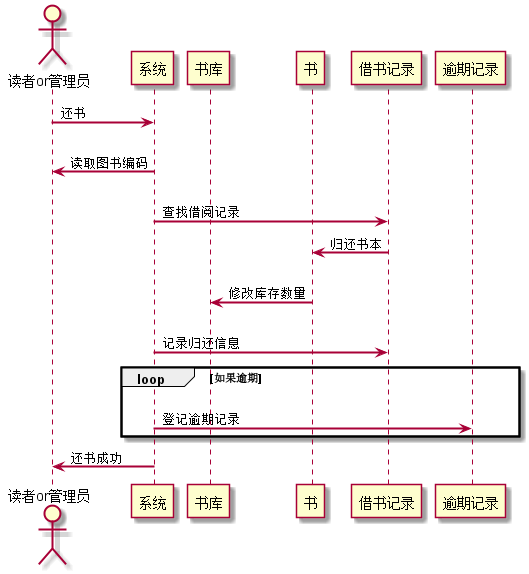

# 实验二：图书管理系统用例建模

| 学号 | 班级 | 姓名 | 照片|
|:----:|:-----:|:----:|:----:|
| 201510414321 | 软件（本）15-3 | 杨汉文| 
# 一、借书用例
## 1.1 Book_lend源码如下：
    @startuml
    skinparam sequenceArrowThickness 2
    skinparam maxmessagesize 60
    
    actor "读者or管理员" as U
    participant "系统" as A
    participant "书库" as B
    participant "书" as C
    participant "借书记录" as D
    
    U -> A: 图书编号或ISBN
    A -> B: 检查是否可借
    B -> C: 提交申请
    C -> B: 响应请求
    B -> A: 修改库存
    A -> D: 创建借书记录
    A -> U: 成功借出图书
    @enduml
## 1.2 借书用例顺序图

## 1.3 借书用例顺序图说明
    通过图书编号或ISBN查找图书，系统在书库中查找是否有库存，再向书发出借出申请，书本可借出则修改库存数量创建借书记录，最后借出图书。
# 二、查询图书用例
## 2.1 Book_search源码如下：
    @startuml
    skinparam sequenceArrowThickness 2
    skinparam maxmessagesize 60
    
    actor "读者or管理员" as U
    participant "系统" as A
    participant "书" as C
    
    U -> A: 输入ISBN或书名
    A -> C: 查询图书信息
    C-> A: 返回查询信息
    A -> U: 输出查询结果
    @enduml
## 2.2 查询用例顺序图

## 2.3 查询用例顺序图说明
    通过图书编号或ISBN查找记录，系统根据用户输入信息查找并返回记录。
# 三、还书用例
## 3.1 Book_return源码如下：
    @startuml
    skinparam sequenceArrowThickness 2
    skinparam maxmessagesize 60
    
    actor "读者or管理员" as U
    participant "系统" as A
    participant "书库" as B
    participant "书" as C
    participant "借书记录" as D
    participant "逾期记录" as E
    
    U -> A: 还书
    A -> U:读取图书编码
    A -> D:查找借阅记录
    D -> C:归还书本
    C -> B: 修改库存数量
    A -> D: 记录归还信息
    loop 如果逾期
    A-> E:登记逾期记录
    end
    A->U:还书成功
    @enduml
## 3.2 还书用例顺序图

## 3.3 还书用例顺序图说明
    归还图书时，系统读取图书的编码，然后系统去借书系统中查找相应的记录，找到记录后归还书本，修改图书库存数量，记录还书记录，提示用户还书成功；如果用户借书时间逾期，则记录逾期借书记录。
# 四、管理员用例
## 4.1 Manager源码如下：
    @startuml
    skinparam sequenceArrowThickness 2
    skinparam maxmessagesize 60
    
    actor 管理员 as U
    participant "系统" as A
    participant "读者" as B
    
    U->A:管理读者
    U->A:输入查询信息
    A->B:查询读者
    B->A:查询结果
    A->U:显示查询结果
    U->A:提交修改后的读者信息
    A->B:修改读者信息
    B->A:修改成功
    A->U:修改成功
    @enduml
## 4.2 管理员用例顺序图

## 4.3 管理员用例顺序图说明
`   `管理读者信息用例顺序图的参与者为管理员，管理员发起管理读者请求，并输入查询信息，系统根据查询信息查找读者， 并返回结果，管理员修改需要修改的信息并提交，系统修改读者信息，返回修改成功信息。
