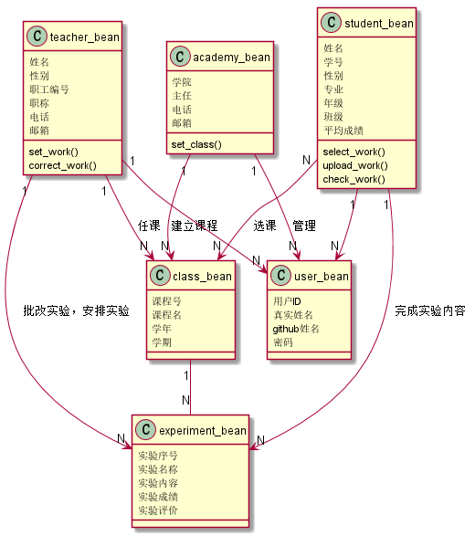

# 基于GitHub的实验管理平台的分析与设计

### 成都大学信息科学与工程学院

|学号|班级|姓名|照片|
|:-------:|:-------------: | :----------:|:---:|
|201510414321|软件(本)15-3|杨汉文||

## 1. 概述
- 基于GitHub的实验管理平台的作用是在线管理实验成绩的Web应用系统。学生和老师的实验内容均存放在GitHUB
页面上。
- 学生的功能主要有：一是设置自己的GitHub用户名，二是选课，三是根据老师实验要求完成实验内容，四是查询自己的实验成绩。学生的GitHub用户名是公开的，但成绩不公开。
- 老师的功能主要有：一是选课，二是安排实验，三是批改每个学生的成绩。
- 老师安排的实验只有通过了教务出的审核才会被发布到平台上。
- 选课先由老师选，再由学生选。老师可以选择要任教的选修课和必修课，学生只能选择要上的选修课。
- 老师和学生都能通过本系统的链接方便地跳转到学生的每个GitHUB实验目录，以便批改实验或者查看实验情况。
- 实验成绩按数字分数计算，每项实验的满分为100分，最低为0分。
- 系统自动计算每个学生的所有实验的平均分。
    
## 2. 系统总体结构

    
## 3. 用例图设计 [源码](use_case.puml)

## 4. 类图设计 [源码](class_diagram.puml)

## 5. 数据库设计
- ### [参见数据库设计](./database.md)

## 6. 用例及界面详细设计
- ### [“修改密码”用例](./use_case/change_pawd.md),[界面](https://github.com/yhw0709/is_analysis/test6/ui/logout.html)
- ### [“选课”用例](./use_case/select_work.md),[界面](https://github.com/yhw0709/is_analysis/test6/ui/logout.html)
- ### [“查询实验成绩”用例](./use_case/check_work.md),[界面](https://github.com/yhw0709/is_analysis/test6/ui/work_student.html)
- ### [“安排实验”用例](./use_case/set_work.md),[界面](https://github.com/yhw0709/is_analysis/test6/ui/class_teacher.html)
- ### [“完成实验内容”用例](./use_case/upload_work.md),[界面](https://github.com/yhw0709/is_analysis/test6/ui/work_student.html)
- ### [“修改用户信息”用例](./use_case/change_info.md),[界面](https://github.com/yhw0709/is_analysis/test6/ui/logout.html)
- ### [“查看用户信息”用例](./use_case/check_info.md),[界面](https://github.com/yhw0709/is_analysis/test6/ui/logout.html)
- ### [“登出”用例](./use_case/logout.md),[界面](https://github.com/yhw0709/is_analysis/test6/ui/logout.html)
- ### [“登录”用例](./use_case/login.md),[界面](https://github.com/yhw0709/is_analysis/test6/ui/index.html) 
- ### [“批改实验”用例](./use_case/correct_work.md),[界面](https://github.com/yhw0709/is_analysis/test6/ui/work_teacher.html)