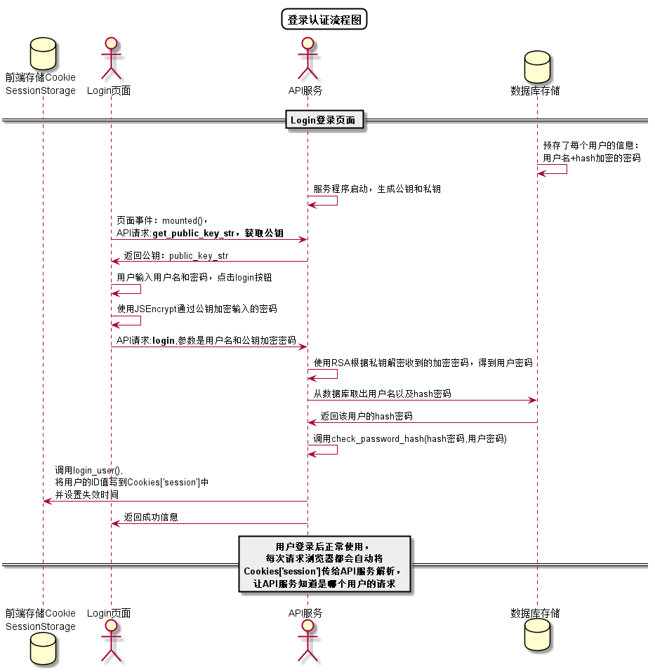


# 修改密码用例 [返回](../README.md)
## 1. 用例规约

|用例名称|修改密码|
|-------|:-------------|
|功能|修改用户的密码|
|参与者|所有用户|
|前置条件|必须先登录|
|后置条件|修改密码以后强制登出，再跳转到登录页面|
|主事件流| 1.用户输入原密码 2.用户填写新密码（两次输入）   3.用户提交修改信息  4.核对信息 5.系统存储修改后密码|
|备选事件流|1.用户两次输入的密码不同  &nbsp;&nbsp; a.系统提示两次输入的密码不相同   &nbsp;&nbsp; b.用户重新填写并提交 2.用户输入的原始密码错误 &nbsp;&nbsp; a.系统提示原始密码错误 &nbsp;&nbsp; b.用户重新填写并提交|

## 2. 业务流程
无

## 3. 界面设计
- 界面参照: https://github.com/yhw0709/is_analysis/test6/ui/logout.html
- API接口调用
    - 接口1：[setPassword](../interface/setPassword.md)

## 4. 算法描述 [源码](../sequence_diagram/login_work.puml)

    
## 5. 参照表
users
- [USERS](../database.md/#USERS)
