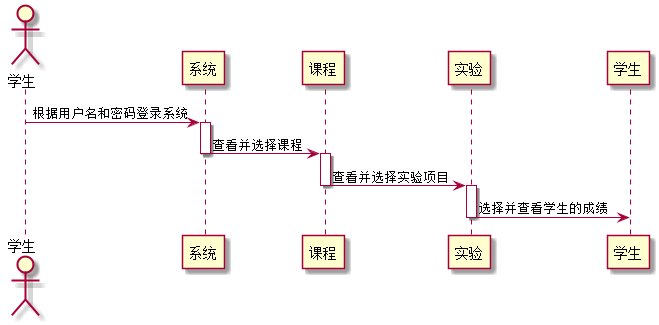

#查询实验成绩用例[返回](../README.md)
## 1. 用例规约

|用例名称|查看实验成绩|
|-------|:-------------|
|功能|学生查看老师对自己实验结果的评分和评价|
|参与者|学生|
|前置条件| 学生要先登陆|
|主流事件| 1.学生选择实验 2.点击查看成绩进入成绩页面|

## 2. 业务流程[源码](../sequence_diagram/check_work.puml)

## 3. 界面设计
- 界面参照:  https://yhw0709.github.io/is_analysis/test6/ui/work_student.html
- API接口调用
    - 接口1：[getSccore](../interface/getScore.md)

## 4. 算法描述
- WEB_SUM解析为列表
  - WEB_SUM是接口getTest的返回值中的一部分，形如："WEB_SUM": "Y,Y,Y,Y,Y,N"。需要在前端进行解析。
  - 作用是判断GitHub网址是否正确，用逗号分开，Y代表正确，N代表不正确。
  - 第1位代表总的GitHUB地址是否正确，第2位表示第1次实验的地址，第3位表示第2位实验地址，依此类推。
  - 比如：“Y,Y,Y,Y,Y,N”表示第5次实验地址不正确，其他地址正确。
  - 算法是使用使用字符串分离方法将其分开。

## 5. 参照表

- [TEST](../database.md/#TEST)
- [STUDENTS](../database.md/#STUDENTS)
