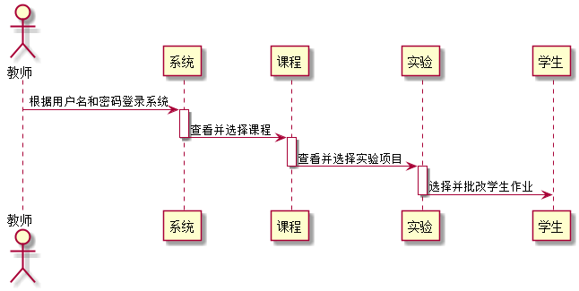

#批改实验用例[返回](../README.md)
## 1. 用例规约

|用例名称|批改实验|
|-------|:-------------|
|功能|老师批改学生的实验结果|
|参与者|老师|
|前置条件| 需要安排实验得到学生的实验结果|
|主流事件| 1.教师进入学生列表页面 2.教师点击“批改”进入学生实验界面 3.教师评分并提交|
|备注| 1.教师点击“重置”重置评分评语 2.教师点击“返回”回到学生列表界面|

## 2. 业务流程[源码](../sequence_diagram/correct_work.puml)
 

## 3. 界面设计
- 界面参照: https://github.com/yhw0709/is_analysis/test6/ui/work_teacher.html
- API接口调用
    - 接口1：[setSccore](../interface/setScore.md)

## 4. 算法描述
- WEB_SUM解析为列表  
  - WEB_SUM是接口getTest的返回值中的一部分，形如："WEB_SUM": "Y,Y,Y,Y,Y,N"。需要在前端进行解析。  
  - 作用是判断GitHub网址是否正确，用逗号分开，Y代表正确，N代表不正确。  
  - 第1位代表总的GitHUB地址是否正确，第2位表示第1次实验的地址，第3位表示第2位实验地址，依此类推。
  - 比如：“Y,Y,Y,Y,Y,N”表示第5次实验地址不正确，其他地址正确。  
  - 算法是使用使用字符串分离方法将其分开。

    
## 5. 参照表

- [TEST](../database.md/#TEST)
- [STUDENTS](../database.md/#STUDENTS)