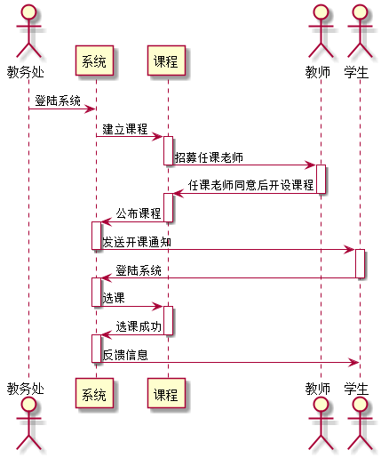

# 选课用例 [返回](../../README.md)
## 1. 用例规约

|用例名称|选课|
|-------|:-------------|
|功能|学生和老师选择列表所列课程|
|参与者|学生|
|前置条件|学生，需要先登录|
|主事件流| 1.点击“条件课程”按键，进入选课界面 2.在学科界面点击“添加课程”来添加课程|
|备选事件流|1.学生点击返回放弃选课 |

## 2. 业务流程（顺序图） [源码](../sequence_diagram/select_class.puml)
 

## 3. 界面设计
- 界面参照: https://github.com/yhw0709/is_analysis/test6/ui/logout.html
- API接口调用
    - 接口1：[getStudents](../interface/getStudents.md) 

## 4. 算法描述

- WEB_SUM解析为列表  
  - WEB_SUM是接口getStudents的返回值中的一部分，形如："WEB_SUM": "Y,Y,Y,Y,Y,N"。需要在前端进行解析。  
  - 作用是判断GitHub网址是否正确，用逗号分开，Y代表正确，N代表不正确。  
  - 第1位代表总的GitHUB地址是否正确，第2位表示第1次实验的地址，第3位表示第2位实验地址，依此类推。
  - 比如：“Y,Y,Y,Y,Y,N”表示第5次实验地址不正确，其他地址正确。  
  - 算法是使用使用字符串分离方法将其分开。

    
## 5. 参照表

- [STUDENTS](../database.md/#STUDENTS)
- [TEACHERS](../database.md/#TEACHERS)
- [TEST](../database.md/#TEST)

